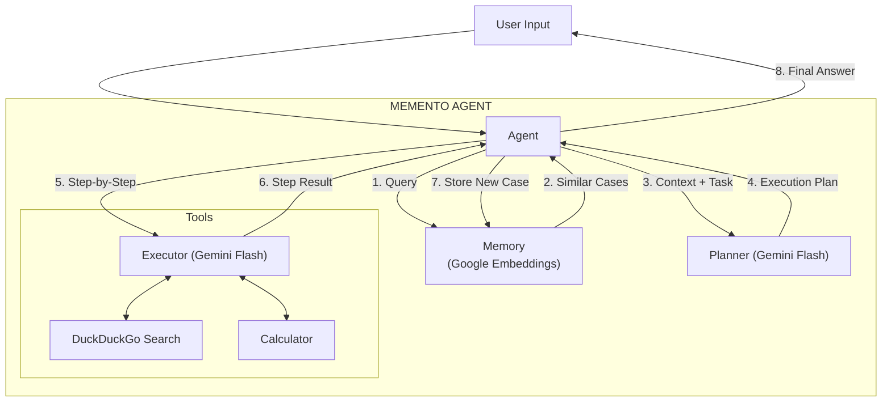

# 🧠 Memento: The Agent with "Muscle Memory"

**Memento** is a lightweight, Google GenAI-powered implementation of the research paper *"Memento: Fine-tuning LLM Agents without Fine-tuning LLMs"*.

Instead of relying solely on prompt engineering or expensive fine-tuning, Memento gives your agent **Long-Term Procedural Memory**. It records every success and failure, building a "Case Bank" of experience that it consults before solving new tasks.

---

## ✨ Features

*   **🧠 Case-Based Reasoning**: Retrieves past strategies (successes AND failures) to guide current planning.
*   **⚡ Google GenAI Stack**: Built for speed using `gemini-2.5-flash` for reasoning and `gemini-embedding-001` for memory.
*   **🖥️ Glass-Box UI**: A beautiful **Streamlit** interface that reveals the agent's internal thought process (Memory, Plans, Tools).
*   **📉 Burn Book**: Learns from mistakes by retrieving past failures to avoid repeating them.
*   **🧪 Verification Suite**: Includes tools to rigorously verify memory recall and generalizability.

---

## 🏗️ Architecture

1.  **Hippocampus (Memory)**: Stores traces primarily using **Non-Parametric Memory** (Cosine Similarity on Google Embeddings).
2.  **Planner (Gemini Flash)**: Decomposes tasks into generic steps, influenced by retrieved "Case Studies".
3.  **Executor (Gemini Flash)**: Executes steps using a suite of tools (Calculator, Search, REPL).

### System Diagram



---

## 🚀 Getting Started

### 1. Prerequisites
*   Python 3.10+
*   [uv](https://github.com/astral-sh/uv) (Recommended) or pip
*   A **Google Cloud API Key** (for Gemini)

### 2. Installation

Clone the repo and install dependencies:

```bash
git clone https://github.com/yourusername/Memento.git
cd Memento
uv sync
```

### 3. Configuration

Create a `.env` file in the root directory:

```bash
GOOGLE_API_KEY=your_actual_api_key_here
```

Review `config.yaml` to customize models (optional):

```yaml
llm:
  model: gemini-1.5-flash
embedding:
  provider: google
  model: gemini-embedding-001
```

---

## 🎮 Usage

### Run the Web Interface
The best way to interact with Memento is the Streamlit UI:

```bash
uv run streamlit run src/app.py
```

*   **Left Panel**: Chat with the agent.
*   **Right Panel**: See the "Brain" (Retrieved Memories, Live Plan Status, Tool Logs).
*   **Diagnostics**: Click "Run Diagnostics 🧪" in the sidebar to verify your API connection and memory integrity.

### Run Verification Tests
To ensure the memory system aligns with the research paper's benchmarks:

```bash
uv run python src/verify_retrieval.py
```

---

## 🧪 Research vs. MVP

This repository implements the **Non-Parametric** memory approach (Cosine Similarity) described in the paper.

*   **Paper**: Uses a learned Q-Function (Parametric Memory) to predict the *utility* of a memory.
*   **This implementation**: Uses Semantic Similarity (Non-Parametric) for speed and simplicity, which the paper acknowledges as a strong baseline.

---

## 📂 Project Structure

*   `src/app.py`: Streamlit entry point and UI logic.
*   `src/agent.py`: Core `MementoAgent`, `Planner`, and `Executor` classes.
*   `src/memory.py`: `CaseBank` implementation using Google Embeddings.
*   `src/tools.py`: Tool definitions (Calculator, Search).
*   `src/verify_retrieval.py`: Script to validate memory recall against seed data.
*   `memory.json`: The persistent file where your agent stores its experiences.

---

*Based on "Memento: Fine-tuning LLM Agents without Fine-tuning LLMs" (Zhou et al., 2025).*
